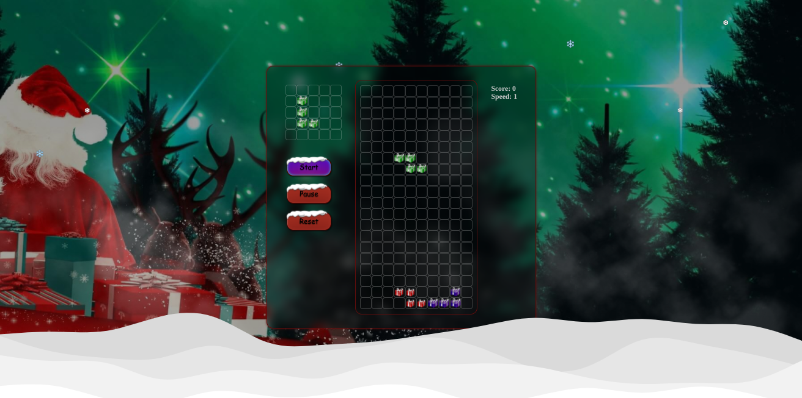
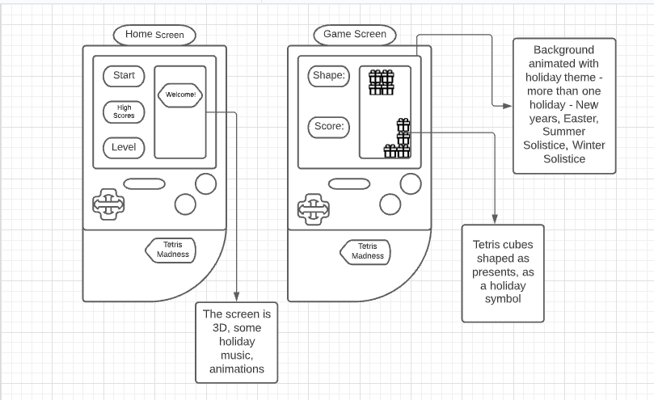

# Tetris Game Holiday Theme

This game is to entertain the user and making a nice holiday mood while playing the only game that has been in outer space according to these interesting [facts](https://www.dailydot.com/parsec/tetris-game-facts/)

The image of the finished game 

## Wireframe

- Original idea

## Building

### Programs, libraries, modules, frameworks used

- Description of the steps made to create this game
- List programs used

## Instructions

- How to play, steps, options

## Deployment 

- check with team if we want to include this section

## Creators of this game with links to each git repo's

## Resources

The links to helpful material from other coders